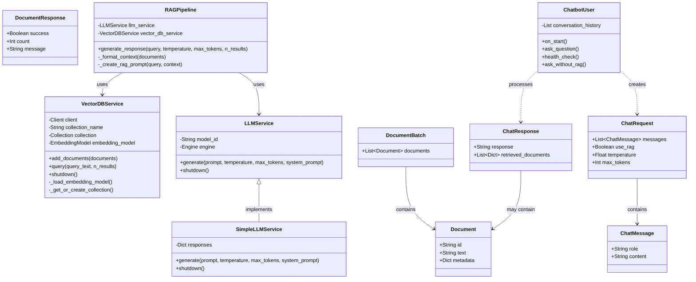

# Scalable LLM RAG Chatbot Class Diagram

This diagram illustrates the main classes and their relationships in the Scalable LLM RAG Chatbot project.

## Class Descriptions

### API Models
- **ChatMessage**: Represents a message in the conversation with role and content
- **ChatRequest**: Encapsulates a request to the chat endpoint with messages and parameters
- **ChatResponse**: Contains the response from the chatbot and any retrieved documents
- **Document**: Represents a document in the vector database with text and metadata
- **DocumentBatch**: A collection of documents to be added to the vector database
- **DocumentResponse**: Response after adding documents to the vector database

### Core Services
- **RAGPipeline**: Orchestrates the RAG process, combining document retrieval with LLM generation
- **VectorDBService**: Manages interactions with the vector database, including document storage and retrieval
- **LLMService**: Interface for generating text from a large language model
- **SimpleLLMService**: A simplified implementation of LLMService with predefined responses

### Load Testing
- **ChatbotUser**: Simulates user behavior for load testing the chatbot API

### Key Relationships
- The RAGPipeline combines the LLMService and VectorDBService to provide enhanced responses
- ChatbotUser creates ChatRequests and processes ChatResponses during load testing
- API models are used to structure data exchange between components 