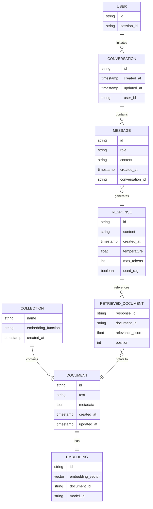

# Scalable LLM RAG Chatbot ER Diagram

This diagram illustrates the entity relationships in the Scalable LLM RAG Chatbot project. While this system primarily works with in-memory objects rather than a traditional database, this ER diagram represents the logical data structures and their relationships.

## Entity Descriptions

### Primary Entities

- **USER**: Represents users interacting with the chatbot
  - This entity is conceptual as the system doesn't currently implement user authentication

- **CONVERSATION**: Represents a chat session with one or more messages
  - In the current implementation, conversation history is managed in-memory during API calls

- **MESSAGE**: Individual messages in a conversation
  - Has a role (user/assistant) and content

- **DOCUMENT**: Text documents stored in the vector database
  - Contains the actual text and associated metadata
  - These are persisted in the ChromaDB vector database

- **EMBEDDING**: Vector representation of a document
  - Used for semantic similarity search
  - Generated using a sentence transformer model

- **COLLECTION**: A named group of documents in the vector database
  - In ChromaDB, collections organize related documents

- **RESPONSE**: The chatbot's generated responses
  - May include references to retrieved documents

- **RETRIEVED_DOCUMENT**: Junction entity that links responses to the documents used for generation
  - Includes relevance score and position in the results

## Relationship Descriptions

- A User can initiate multiple Conversations
- A Conversation contains multiple Messages
- A Message (from a user) generates a Response
- A Collection contains many Documents
- Each Document has exactly one Embedding
- A Response may reference multiple Retrieved Documents when RAG is used
- Each Retrieved Document points to a Document in the vector database

## Implementation Notes

In the actual implementation:
- ChromaDB handles the storage of Documents, Embeddings, and Collections
- Conversations and Messages are managed as transient objects during API calls
- User identity is not tracked in the current system
- Documents are added to the vector database through a dedicated API endpoint 