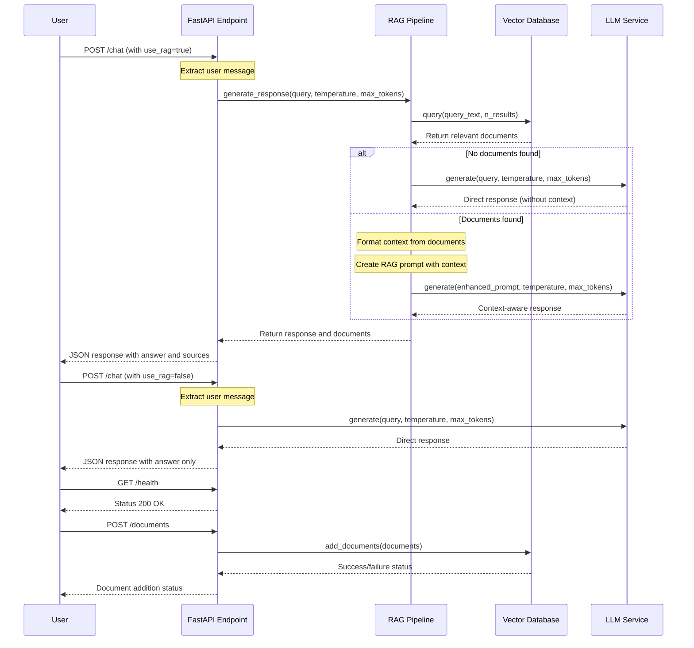

# Scalable LLM RAG Chatbot Sequence Diagram

This diagram illustrates the sequence of interactions between components when a user queries the chatbot.

## Sequence Description

### RAG-Enabled Query Flow
1. User sends a chat request with `use_rag=true`
2. API extracts the user message
3. RAG Pipeline receives the query
4. Vector Database is queried for relevant documents
5. If documents are found:
   - RAG Pipeline formats the context
   - RAG Pipeline creates an enhanced prompt
   - LLM Service generates a context-aware response
6. If no documents are found:
   - LLM Service generates a direct response without context
7. Response (and any retrieved documents) are returned to the user

### Direct LLM Query Flow (without RAG)
1. User sends a chat request with `use_rag=false`
2. API extracts the user message
3. LLM Service directly generates a response
4. Response is returned to the user

### Health Check Flow
1. User sends a GET request to /health
2. API returns status 200 OK

### Document Addition Flow
1. User sends documents to be added to the vector database
2. Vector Database Service stores the documents
3. Success/failure status is returned to the user 