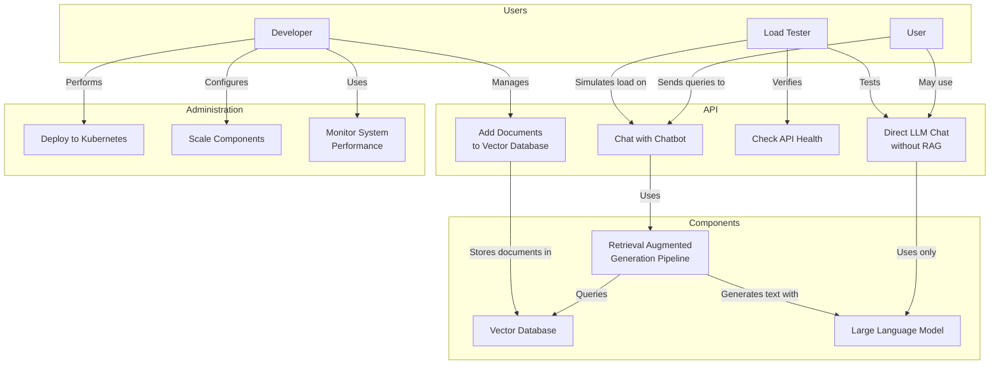

# Scalable LLM RAG Chatbot Use Case Diagram

This diagram illustrates the main use cases and actors in the Scalable LLM RAG Chatbot project.

## Description of Use Cases

### User Use Cases
- **Chat with Chatbot**: Main interaction where users send queries and receive responses enhanced with relevant knowledge from the vector database
- **Direct LLM Chat without RAG**: Alternative mode where users can interact directly with the LLM without knowledge retrieval

### Developer Use Cases
- **Add Documents to Vector Database**: Upload and manage the knowledge base for RAG
- **Deploy to Kubernetes**: Set up the system on Kubernetes infrastructure
- **Scale Components**: Configure auto-scaling for handling varying loads
- **Monitor System Performance**: Track metrics and system health

### Load Tester Use Cases
- **Simulate User Load**: Generate synthetic traffic to test system under load
- **Test API Health**: Verify system is operational
- **Test Different Query Types**: Check both RAG and non-RAG modes of operation

### Key Components
- **RAG Pipeline**: Coordinates retrieval and generation
- **Vector Database**: Stores and retrieves relevant documents
- **LLM Service**: Generates responses based on user queries and context 